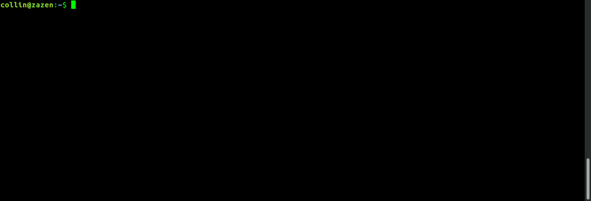
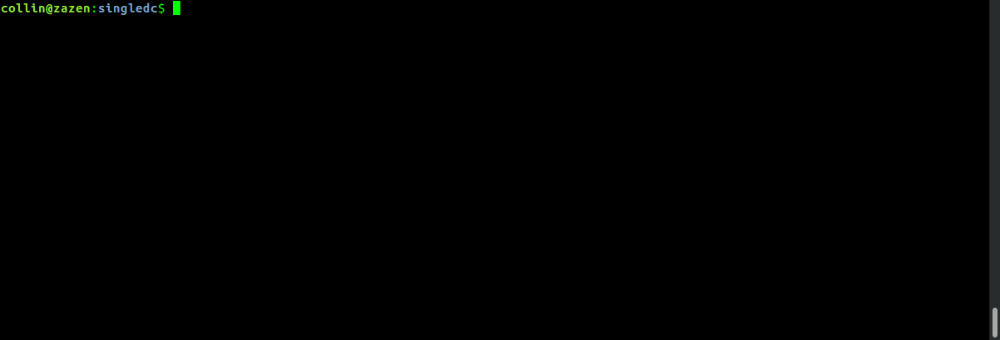

# amazon-cloudformation-dse

This repo contains AWS CloudFormation templates and related scripts to quickly
spin up a DataStax Enterprise cluster.

- [singledc](./singledc): spin up a DSE cluster that spans a single datacenter.
- multidc (coming soon)

# Deploying to AWS

## Setup

The only setup required is to install and configure the [AWS CLI](http://docs.aws.amazon.com/cli/latest/userguide/installing.html).  Documentation for the AWS CLI is [here](http://docs.aws.amazon.com/AWSCloudFormation/latest/UserGuide/cfn-using-cli.html).  To configure the AWS CLI run the command `aws configure` and follow the prompts.

To check if the AWS CLI is properly configured running `aws ec2 describe-account-attributes` should show similar output as below.



## Clone and Investigate the Repo

To clone this repo use the command:
```
git clone https://github.com/DSPN/amazon-cloudformation-dse.git
```
The *singledc* directory contains 2 files to spin up a DSE cluster: _deploy.sh_ which references *cloudformation_dse.json* an AWS CloudFormation template which describes the architecture of the cluster. After installing the AWS CLI, you can spin up a cluster simply by running `deploy.sh` which will use default values.

The contents of the *multidc* directory are a work in progress.

## Creating a Cluster

While you can simply run `deploy.sh` the script understands several arguments which can be seen by running `./deploy.sh -h`

```
---------------------------------------------------
Usage:
deploy.sh [-h] [-e email] [-k keypair] [-v vpc] [-s size] [-d dcname]
              [-i instance] [-l sshlocation] [-r region]

Options:

 -h             : display this message and exit
 -e email       : email to send stack updates, default donotreply@datastax.com
 -k keypair     : keypair name, if not passed a new key named dse-keypair-$region
                  will be generated and saved to ~/.ssh
 -v vpc         : VPC, VPC to spin up cluster in, if not passed account default VPC used
 -s size        : cluster size (number of Cassandra nodes), if not passed template
                  default 4 (3+1 seed) used
 -d dcname      : datacenter name, default 'dc0'
 -i instance    : instance type, default m4.large
 -l sshlocation : CIDR block instances will accept ssh connections from, if not passed
                  template default 0.0.0.0/0 (everywhere) used
 -r region      : AWS region, if not passed account default used

---------------------------------------------------

```

Most of these options are self explanatory, but there are a few points worth expanding on.
- All the default values are defined in the template except _region_ and _vpc_ which are AWS account defaults.
- The _key-pair_ and _vpc_ used must be created in the region being used. The generated key-pair and default vpc satisfy this requirement.

When you call the script (with or without options) you'll see output similar to this:


After calling the script the cluster should spin up in < 15 minutes. You can watch its progress either from the AWS web console [CloudFormation](https://console.aws.amazon.com/cloudformation/home) page or by running `aws cloudformation describe-stack-events --stack-name dse-stack`

After the stack has completed in the _Outputs_ section of the web console there's a link to the OpsCenter web interface which will be something like:
`http://ec2-52-52-131-168.us-east-1.compute.amazonaws.com:8888/`

This URL can also be found by running `aws cloudformation describe-stacks --stack-name dse-stack --query 'Stacks[0].Outputs[*]'`



## OpsCenter
Opening this URL in a browser will present the OpsCenter interface to the cluster.


## Caveats
- Currently these scripts have basic functionality and bugs certainly exist.
- All instances use an EBS volume that is set to be disposed when the instance is terminated.
- If not using the default _vpc_ it must be created **prior** to calling the script. This can be done by calling a command like the one below. The _--region_ argument is optional while _--cidr-block_ is manditory

```
aws ec2 create-vpc --region us-east-1 --cidr-block 10.0.0.0/16
```

- The template is currently only valid for the 3 US regions: _us-west-1 us-west-2 us-east-1_
- The instance type _t2.medium_ is included only for testing purposes and should not be used for a real cluster.
- This template uses an _AutoScalingGroup_ to bring up non-seed nodes. This group isn't intended to be dynamically scaled. While growing the size of this group most likely will work, shrinking it will have unknown side effects.

## Deleting a Deployment

The CFN stack contains all nodes and the OpsCenter instance and can be deleted via the command line or the [web console](https://console.aws.amazon.com/cloudformation/home). To use the command line type the command:

    aws cloudformation delete-stack --stack-name dse-stack

## Next Steps

If you want to learn more about DataStax Enterprise, the online training courses at https://academy.datastax.com/ are a great place to start.
